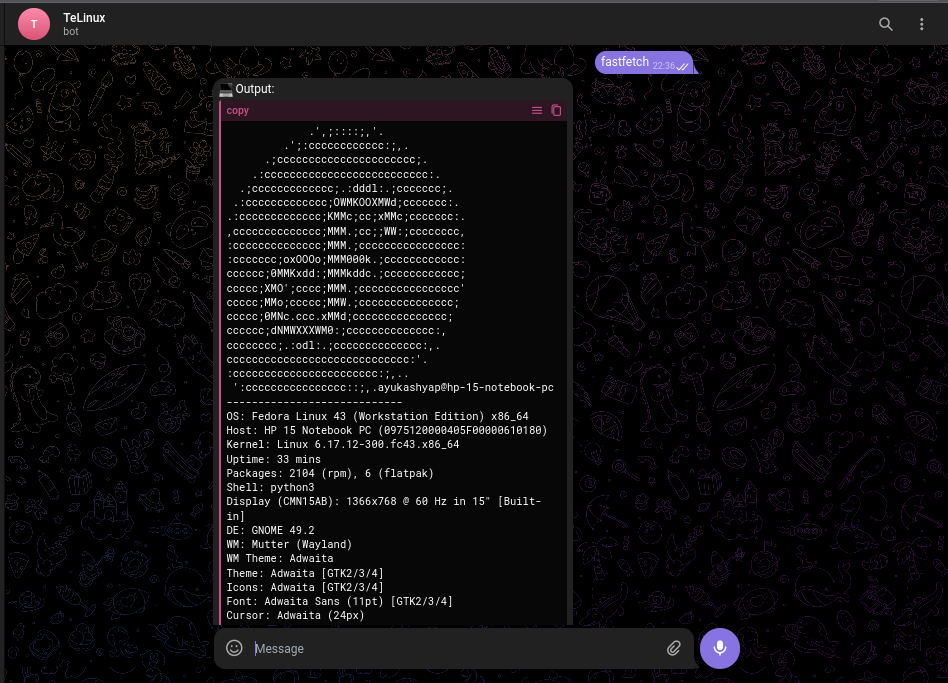

# ⚡ TeLinux - Remote Linux Control via Telegram

**TeLinux** is a secure, Python-based automation tool that allows you to control your Linux machine remotely through a Telegram bot. It transforms your chat into a functional terminal, enabling shell execution, file management, and system monitoring from anywhere.

---

## 🌟 Key Features

* **💻 Remote Terminal:** Run any standard shell command (`ls`, `whoami`, `git status`) and receive the output instantly.
* **🛡️ Freeze Protection:** A built-in safety engine automatically blocks interactive commands (like `cmatrix`, `vim`, `nano`) that would cause the bot to hang.
* **🚀 Fire-and-Forget GUI:** Launch graphical applications like `firefox`, `chrome`, or `vscode` on your PC screen instantly without blocking the bot's operation.
* **📂 Bidirectional File Transfer:**
    * **Download (Pull):** Use `/pull filename` to send files from your PC to your phone.
    * **Upload (Push):** Send any file to the bot to save it directly to your current working directory.
* **⚡ Auto-Sudo Integration:** The bot identifies privileged commands (like `dnf`, `apt`, `reboot`) and applies `sudo` automatically.
* **📊 Health Dashboard:** Get real-time stats on CPU, RAM, and Disk usage via the `/health` command.

---

## 📸 Demo


---

## 🛠️ Requirements

* **Operating System:** Any Linux distribution (Fedora, Ubuntu, Debian, Arch, Kali, etc.)
* **Python:** Version 3.12 or newer.
* **Telegram:** A Bot Token obtained from [@BotFather](https://t.me/BotFather).

---

## ⚙️ Setup & Installation

### 1. Install System Dependencies

**Fedora / RHEL / CentOS:**
```bash
sudo dnf install python3-pip zip
```

**Ubuntu / Debian / Kali / Mint:**
```bash
sudo apt update
sudo apt install python3-pip zip python3-venv
```

**Arch Linux / Manjaro:**
```bash
sudo pacman -S python-pip zip
```

### 2. Install Python Libraries
```bash
pip install python-telegram-bot psutil
```

### 3. Configure the Bot
Edit your `tele_shell.py` file and update the configuration section with your specific details:
```python
# --- CONFIGURATION ---
TOKEN = "YOUR_BOT_TOKEN_HERE"      # Your Bot API Token
AUTHORIZED_USER_ID = 123456789     # Your numerical Telegram ID
```

---

## 🚀 Finalizing System Integration

### Step 1: Configure Password-less Sudo
To allow the bot to manage system updates and power states without a password prompt:

1.  Open the sudoers editor: `sudo visudo`
2.  Add this line at the very bottom (replace `youruser` with your actual Linux username):
```text
youruser ALL=(ALL) NOPASSWD: /usr/sbin/reboot, /usr/sbin/shutdown, /usr/bin/dnf, /usr/bin/apt, /usr/bin/pacman, /usr/bin/systemctl
```

### Step 2: Enable Autostart (Systemd)
To ensure the bot runs 24/7 and starts automatically when your PC turns on:

1.  **Create the directory:**
    ```bash
    mkdir -p ~/.config/systemd/user
    ```

2.  **Create the service file:**
    ```bash
    nano ~/.config/systemd/user/pcbot.service
    ```

3.  **Paste the following:**
    ```ini
    [Unit]
    Description=TeLinux Remote Control
    After=network.target

    [Service]
    # IMPORTANT: Update the path below to your actual script location
    ExecStart=/usr/bin/python3 /home/youruser/TeLinux/tele_shell.py
    Restart=always
    Environment=PYTHONUNBUFFERED=1

    [Install]
    WantedBy=default.target
    ```

4.  **Enable Lingering & Start:**
    ```bash
    # Allows the bot to run even when you aren't logged in
    sudo loginctl enable-linger $USER

    systemctl --user daemon-reload
    systemctl --user enable --now pcbot.service
    ```

---

## 📱 Bot Commands

| Command | Description |
| :--- | :--- |
| `/start` | Initialize connection and check status. |
| `/help` | View all available features and safety rules. |
| `/health` | View CPU, RAM, and Disk usage stats. |
| `/pull [file]` | Download a file to your phone (Max 50MB). |
| `cd [folder]` | Navigate folders (Smart Case: handles Capitalized names). |
| `ls` | List all files in the current directory. |
| `firefox` | Open Firefox on your PC screen instantly. |

---

## 🛡️ Safety Architecture

TeLinux uses a dual-layer execution engine to keep your bot stable:

1.  **The Blocklist (Interactive CLI):** Tools that take over the terminal or run forever are blocked to prevent the bot from hanging.
    * *Blocked apps:* `cmatrix`, `vim`, `nano`, `htop`, `top`, `tmux`.
2.  **The GUI Launcher (Fire-and-Forget):** Graphical apps are launched in a detached background session using `DISPLAY=:0`. The bot won't wait for you to close the app before listening for the next command.
    * *Supported apps:* `firefox`, `chrome`, `vlc`, `code`, `nautilus`.

---

## ⚠️ Security Notice
* **Authorization:** The bot only responds to the `AUTHORIZED_USER_ID`. Never remove this check.
* **Token Privacy:** Do not upload your Bot Token to public repositories. Use environment variables for production environments.

## 📝 License
This project is open-source. Feel free to fork and customize!